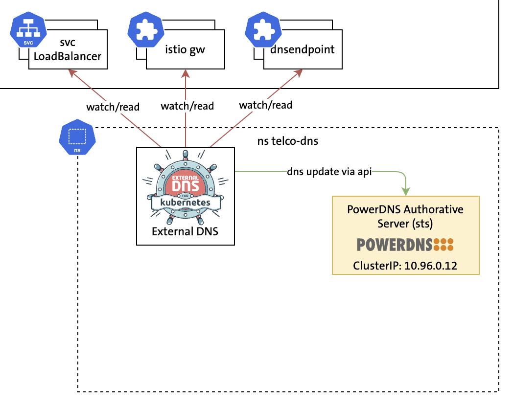

# Demo 1: ExternalDNS & PowerDNS Single Cluster



Before the demo, execute the prepare-demo1.sh script in the parent folder.
This demo is using https://github.com/saschagrunert/demo, so to run the demo execute first the build command and then start the auto-demo-forwarding exec with the -l flag. For more options see -h:

```
go build .
./auto-demo-forwarindg -l
```
