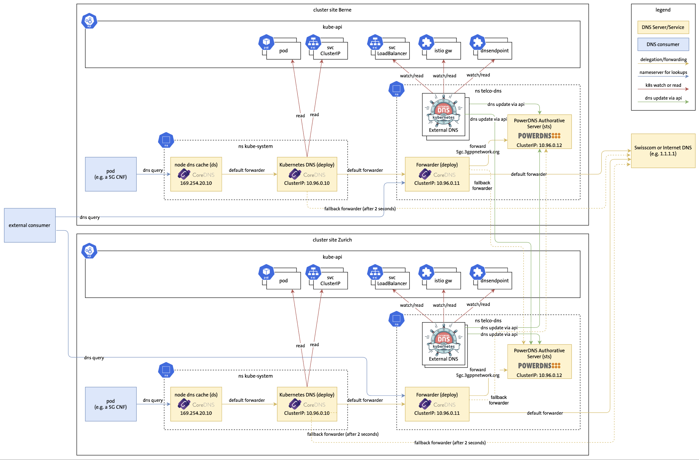

# Demo 3 Multi-cluster DNS



Before the demo, execute the prepare-demo3.sh script in the parent folder.
This demo is using https://github.com/saschagrunert/demo, so to run the demo execute first the build command and then start the auto-demo-3-multi-cluster-dns exec with the -l flag. For more options see -h:

```
go build .
./auto-demo-3-multi-cluster-dns -l
```
