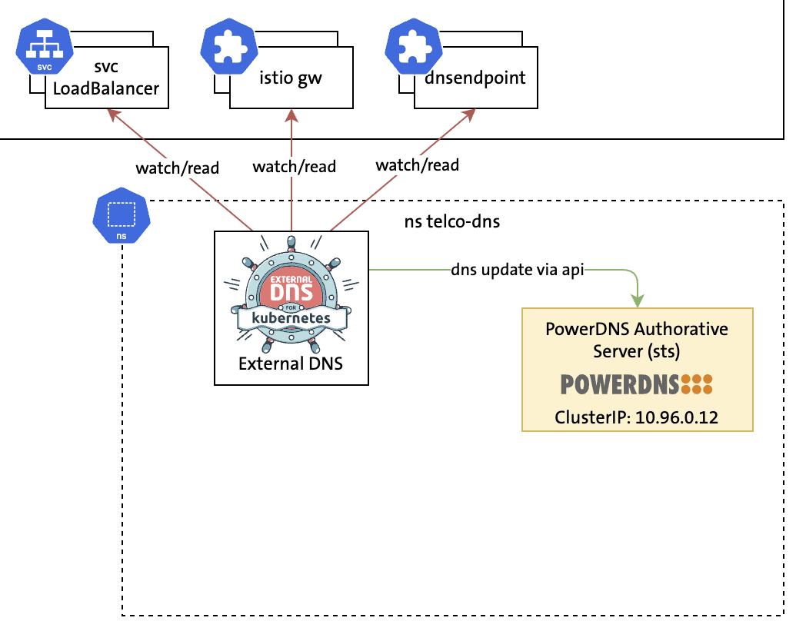

# Demo 1: ExternalDNS & PowerDNS Single Cluster



```
kubectl get svc -n dns -o wide | grep pdns-service
```


```
kubectl --context kind-dns-0 apply -f some-svc.yaml
```

```
kubectl --context kind-dns-0 -n dns logs deploy/external-dns-0 --tail 5
```

```
kubectl --context kind-dns-1 exec -it dnsutils -- dig +noall +answer nginx.5gc.3gppnetwork.org 10.96.0.12
```

```
kubectl --context kind-dns-0 apply -f some-dns-endpoint-cr.yaml
```

```
kubectl --context kind-dns-1 exec -it dnsutils -- dig +noall +answer endpoint1.5gc.3gppnetwork.org 10.96.0.12
```

```
pdnsutil list-all-zones
```

```
pdnsutil list-zone 5gc.3gppnetwork.org
```
