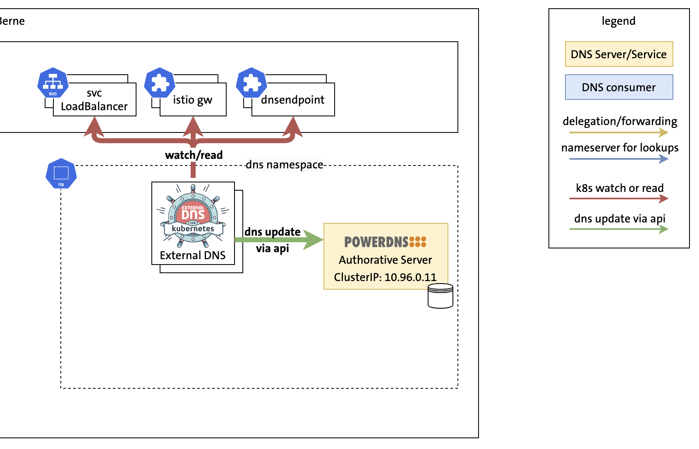

# Demo 1: ExternalDNS & PowerDNS Single Cluster



Before the demo, execute the prepare-demo1.sh script in the parent folder.
This demo can be run using https://github.com/saschagrunert/demo, execute first the build command and then start the demo-1 exec with the -l flag. For more options see -h:

```
go build .
./demo-1 -l
```

## Demo


### 1. Show pods

### 2. Show some-svc.yaml file

```
cat some-svc.yaml
```

### 3. Apply some-svc.yaml

```
kubectl apply -f some-svc.yaml
```

### 4. Check ExternalDNS logs

### 5. Dig PowerDNS for nginx record

```
kubectl exec -it dnsutils -- dig +short nginx.5gc.3gppnetwork.org @10.96.0.12
```

### 6. Show dns-endpoint-cr.yaml

```
cat dns-endpoint-cr.yaml
```

### 7. Apply some-dns-endpoint-cr.yaml
```
kubectl --context apply -f dns-endpoint-cr.yaml
```

### 8. Dig PowerDNS for endpoint1 record
```
kubectl --context kind-dns-1 exec -it dnsutils -- dig +nshort endpoint1.5gc.3gppnetwork.org @10.96.0.12
```
