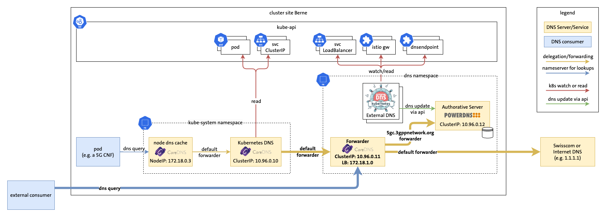

# Demo 2: Forwarding



## Demo Preparation

Before the demo, execute the prepare-demo2.sh script in the parent folder.

## Auto Demo

This demo is using https://github.com/saschagrunert/demo, so to run the demo execute first the build command and then start the demo-2 exec with the -l flag. For more options see -h:

```
go build .
./demo-2 -l
```
## Manual Demo

### List pods

```
kubectl get pods -n dns
```

### Show new coredns configmap in dns namespace

```
kubectl describe cm/coredns -n dns
```

### Show coredns services in dns namespace

```
kubectl get svc -n dns
```

### Show kube-system coredns configmap

```
kubectl describe cm/coredns -n kube-system
```

### Dig nginx using default dns

```
kubectl exec -it dnsutils -- dig +noall +answer nginx.5gc.3gppnetwork.org
```

### Nslookup endpoint1 using default dns

```
kubectl exec -it dnsutils -- nslookup endpoint1.5gc.3gppnetwork.org
```

### Dig nginx service from local machine using coredns loadbalancer ip

```
colima exec -p dns1 dig +noall +answer nginx.5gc.3gppnetwork.org @172.18.1.0
```
