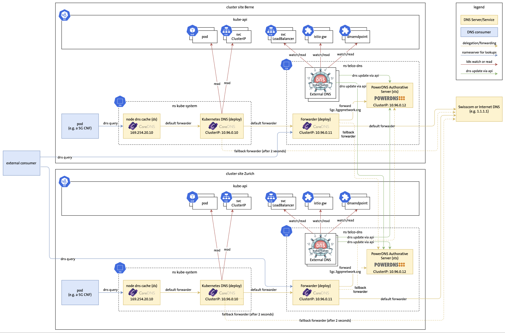

# Demo 3 Multi-cluster DNS



## Demo Preparation

Before the demo, execute the prepare-demo3.sh script in the parent folder.

## Auto Demo

This demo is using https://github.com/saschagrunert/demo, so to run the demo execute first the build command and then start the demo-3 exec with the -l flag. For more options see -h:

```
go build .
./demo-3 -l
```

## Manual Demo

### Show logs of externalDNS-1 deployment
```
kubectl --context kind-dns-0 -n dns logs deploy/external-dns-1
```

### Lookup nginx in cluster 1
```
kubectl --context kind-dns-1 exec -it dnsutils -- nslookup nginx.5gc.3gppnetwork.org
```

### Lookup endpoint1 in cluster 1
```
kubectl --context kind-dns-1 exec -it dnsutils -- nslookup endpoint1.5gc.3gppnetwork.org
```

### Cat dns-endpoint-cr-2.yaml
```
cat dns-endpoint-cr-2.yaml
```


### Apply endpoint-cr-2 to cluster 1
```
kubectl --context kind-dns-1 apply -f dns-endpoint-cr-2.yaml
```

### Show logs of externalDNS-1 deployment in cluster 1
```
kubectl --context kind-dns-1 -n dns logs deploy/external-dns-1
```

### Show logs of externalDNS-0 deployment in cluster 1
```
kubectl --context kind-dns-1 -n dns logs deploy/external-dns-0
```

### Lookup endpoint2 in cluster 0
```
kubectl --context kind-dns-0 exec -it dnsutils -- nslookup endpoint2.5gc.3gppnetwork.org
```

### Scale down powerDNS deployment to 0 in cluster 0
```
kubectl --context kind-dns-0 -n dns scale deployment pdns-deployment --replicas=0
```

### Lookup nginx in cluster 0
```
kubectl --context kind-dns-0 exec -it dnsutils -- nslookup nginx.5gc.3gppnetwork.org
```

### Apply endpoint3 to cluster 0
```
kubectl --context kind-dns-0 apply -f dns-endpoint-cr-3.yaml
```

### Lookup endpoint3 in cluster 1
```
kubectl --context kind-dns-1 exec -it dnsutils -- nslookup endpoint3.5gc.3gppnetwork.org
```

### Lookup endpoint3 in cluster 0
```
kubectl --context kind-dns-0 exec -it dnsutils -- nslookup endpoint3.5gc.3gppnetwork.org
```

### Scale down coredns deployment to 0 in cluster 0
```
kubectl --context kind-dns-0 -n dns scale deployment coredns --replicas=0
```

### Lookup endpoint3 in cluster 0
```
kubectl --context kind-dns-0 exec -it dnsutils -- nslookup endpoint3.5gc.3gppnetwork.org
```

### Lookupp google.com in cluster 0
```
kubectl --context kind-dns-0 exec -it dnsutils -- nslookup google.com
```

### Scale up powerDNS deployment to 1 in cluster 0
```
kubectl --context kind-dns-0 -n dns scale deployment pdns-deployment --replicas=1
```

### Show logs of externalDNS-0 deployment in cluster 0
```
kubectl --context kind-dns-0 -n dns logs deploy/external-dns-0
```
